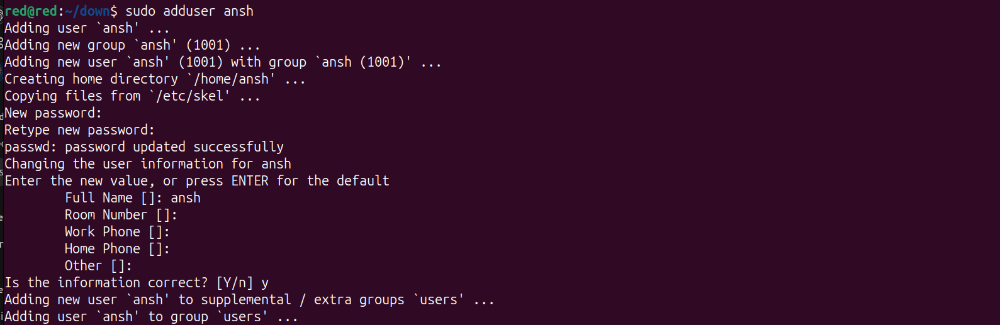
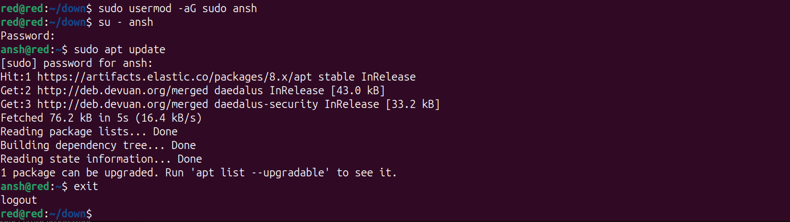
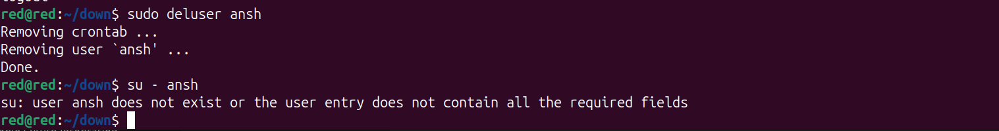
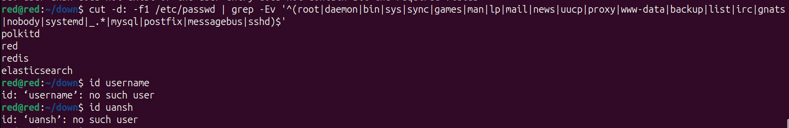

#
# Add & Del users in Devuan

## 1. Add a User

### Basic command:
```bash
sudo adduser username
```

This will:
- Create the user
- Create a home directory (`/home/username`)
- Prompt you to set a password and user info

Example:
```bash
sudo adduser ansh
```

<p align='center' width='100%'>
        
</p>

### Add user to specific groups (optional):
For example, to add the user to the `sudo` group:

```bash
sudo usermod -aG sudo ansh
```

> You can also add them to groups like `audio`, `video`, `docker`, etc., depending on their role.

### Switch to the new user
```bash
su - ansh
```

<p align='center' width='100%'>
        
</p>

##  2. Delete a User

### Basic command:
```bash
sudo deluser username
```

### Delete user and their home directory:
```bash
sudo deluser --remove-home username
```

Example:
```bash
sudo deluser --remove-home ansh
```

<p align='center' width='100%'>
        
</p>

### Check user exists
You can check if a user exists with:

```bash
id username
```

Example:
```bash
id ansh
```

Or view the list of users (excluding system users):

```bash
cut -d: -f1 /etc/passwd | grep -Ev '^(root|daemon|bin|sys|sync|games|man|lp|mail|news|uucp|proxy|www-data|backup|list|irc|gnats|nobody|systemd|_.*|mysql|postfix|messagebus|sshd)$'
```
<p align='center' width='100%'>
        
</p>

#