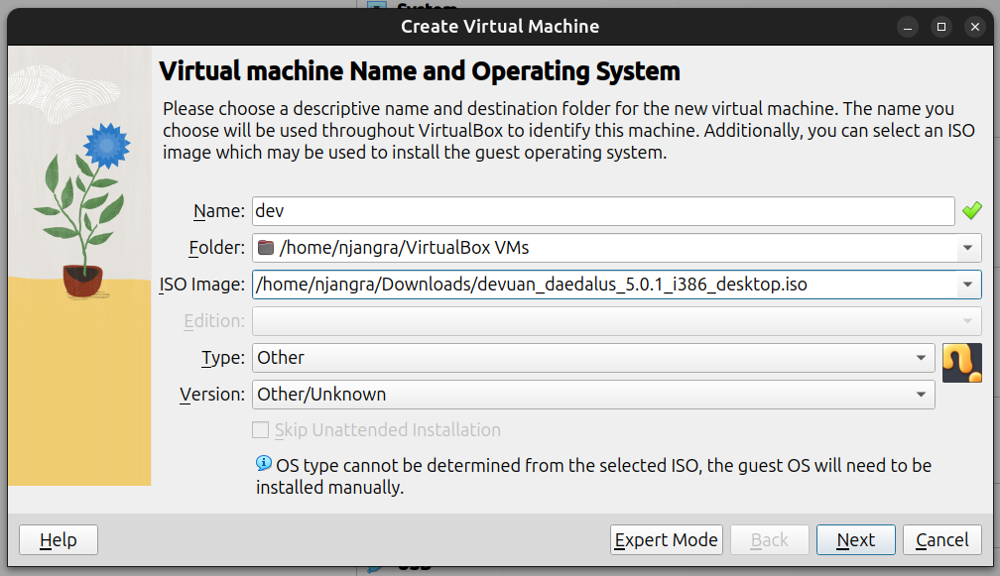
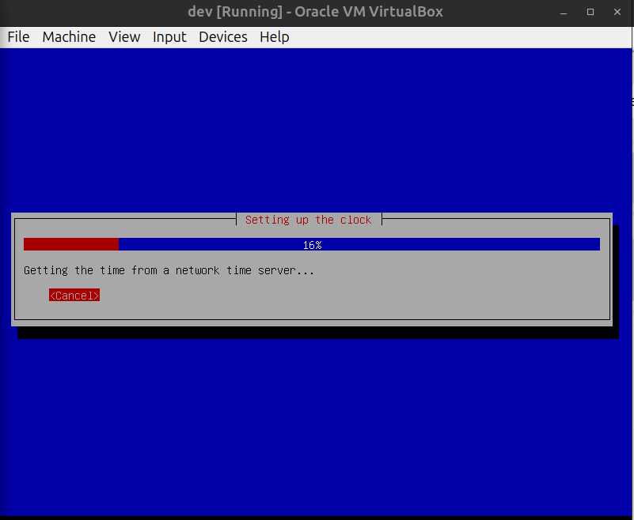

#

    

#
# Devuan Daedalus Install Guide

This is an easy to follow guide to installing Devuan from the CD/DVD images for supported hardware. The general advice accompanying this guide is to always backup all data before beginning.
#
## Prerequisites

As a minimum, knowledge of how to write an ISO image to CD/DVD or USB and make the computer boot from it.
Supported architectures

    amd64
    i386

or, a working virtual machine to setup your OS:

+   [Virtual Box](https://www.virtualbox.org/wiki/Linux_Downloads)

#
## Installation images

These are currently the ways of getting installation images. Please use mirrors or torrents where possible.

Directly from the :
+ [Devuan release archive](https://files.devuan.org/) 
+ From [mirrors](https://www.devuan.org/get-devuan) that may be closer or faster 
+ Via [torrent](https://files.devuan.org/devuan_daedalus.torrent) for the stable releases

#
## Choose from the following installation options:

    The *_netinstall.iso (~480 MB) installs a minimal base system then downloads additional packages from the Devuan repositories during the installation process.

    The *_server.iso (780 MB) is the first of a 4 CD set that allows for a complete off-line server installation. The remaining CDs provide several desktop options and a limited selection of additional software.

        CD2: Xfce (installable from tasksel) and LXDE.
        CD3: MATE (installable from tasksel) and Openbox window manager.
        CD4: Cinnamon (installable from tasksel) but requires CD2 and CD3 to install.

    Use the DVD *_-desktop.iso (4 GB) if there is no network available and/or a need for multiple offline installations. The image contains several desktop choices and additional software options. LXQt and KDE are only available on DVD.

#### Please note that the graphical install option is no longer available due to size constraints.

#
## Writing an image to a CD/DVD or USB drive

Images can be written to a CD or DVD using wodim or any other applications like Etcher, Ventoy for linux or Rufus for windows.

    All Devuan ISO images are hybrid ISOs and may be written to a USB drive using dd.

root@hostname:~# dd if=filename.iso of=/dev/sdX bs=1M && sync

#
## Setting up a vm (optional)

1) start your vm (virtual machine). 

    

2) select machine from the top bar and select new.

    

3) enter your necessary details like name of vm, folder where to install, location of iso image, type & version of OS.

    

4) config the base memory & processors used for your OS.

    

5) select the size of the virtual disk you want to create to use your OS.

    

6) select finish if done, or can go back to change the configurations.

    

7) select your vm & press Start.

    

#
## Installing Devuan

The Devuan Daedalus installer presents itself via Console framebuffer dialog options only because there is no longer a GUI installer available. process carefully, step by step.

1) Boot from the CD/DVD or USB drive and choose the Install option.

    

2) The next few steps will ask about the system language, location and keyboard layout.

    

    

    

3) The installer will automatically configure the network. Wireless network users will have to provide a SSID and a passphrase. Then the installer will ask for a hostname for the new system. Being creative is fine but spaces and special characters will not be accepted.

    

4) Provide a domain name. If this is not needed or you do not know what it is for, leave it blank.

    

5) It is recommended to set a root password for Devuan. It is good security practice to use a strong password. Passwords are always input twice to make sure that there is no mistake.

    

6) Configure a user account for day-to-day activities. Unless there is a need to do otherwise, leave the full name blank and continue to providing a username.

    

    

7) Enter a password and re-type it again as done before for root.

    

8) The installer will now set the clock using NTP. Enter the time zone information if necessary, and continue with the install.

    

  IF FULL DISK ENCRYPTION IS NEEDED SEE HERE BEFORE CONTINUING.

9) Before installing Devuan the disk needs to be partitioned. If free space is available on the disk then choosing to use the largest continuous space is recommended. This will preserve existing partitions and not alter them. Otherwise use the entire disk and ALL DATA on the disk will be LOST.

    

    

10) Choosing all files in one partition is a sensible option for newcomers. Manual disk partitioning is beyond the scope of this guide.

    

    

11) It is time to write those partitions to the disk and format them with file systems. If the proposed changes are satisfactory then choose write to disk and continue. This is the last chance to back out and say no before the changes are made.

    

12) The base system will now install. Depending on the system hardware this may take some time.

    

13) In the case when there is no Internet access or mirror usage is to be avoided, it is recommended to scan additional CDs so that there are more packages available to install.

    

14) If the installion is being performed from a full CD/DVD image, the installer will now ask to enable and choose a network mirror.

It is recommended to use a mirror if there is Internet access so that the latest package versions become available. For an offline installation continue without a mirror.

    

15) Select a Devuan archive mirror. A preferred choice is "deb.devuan.org" unless there is another mirror available that is known to provide faster connectivity .

    

16) Devuan uses popularity contest (popcon) to collect information about the most used packages. This is purely on an opt-in basis and will only collect statistics about packages that are installed from this point onwards.

    

17) The defaults are sufficient to get a working Xfce desktop environment. Note that it is not needed to select Xfce explicitly as it is the default but also a different desktop environment may be chosen. Other options can be included or excluded based on the system requirements.

Note that offline installation may require a retry of the Software selection step. Repeating this action should allow the install to continue.

    

18) The installer will now install the selected packages. This will take some time.

    

19) Next the installer will ask to choose the preferred init system. The default in Devuan is sysvinit.

    

20) Now that all the software required is installed, the GRUB bootloader will be installed. This allows the operating system to boot after installation. If GRUB asks to install to the MBR then this is usually the best choice.

Some setups will require no configuration and the install will now finish.

    

21) It is important to choose the correct bootloader location. It should not be installed to a partition but to the MBR area which is located on the hard disk.

In this example /dev/sda is the only hard disk so we will install it there.

    

22) The install is finished. Remove the installation media to continue to boot into the Devuan graphical environment.

    

    

#