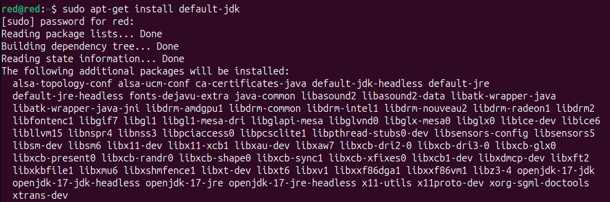

#
# Install Elasticsearch in Devuan/Debian: 

1) Elasticsearch is a Java application, so the first step is to install Java .

    Run the following as root or user with sudo privileges command to install the OpenJDK package:

> sudo apt install default-jdk

<p align='center' width='100%'>
        
</p>
<p align='center' width='100%'>
        
</p>

Verify the Java installation by printing the Java version :

> java -version

The output should look something like this:

<p align='center' width='100%'>
        
</p>

2) Installing Elasticsearch

    Elasticsearch is not available in the standard Debian 10 repositories. We’ll install it from the Elasticsearch APT repository.

    Import the repository’s public key using the following wget command:

    > wget -qO - https://artifacts.elastic.co/GPG-KEY-elasticsearch | sudo apt-key add -

    <p align='center' width='100%'>
        
    </p>
    this means you need something like gnupg, just install it.

    <p align='center' width='100%'>
        
    </p>
    after installing again import public repository key.

     <p align='center' width='100%'>
        
    </p>

    The command above should output OK, which means that the key has been successfully imported, and packages from this repository will be considered trusted.

    Add the Elasticsearch repository to the system by running:

   > echo "deb [signed-by=/usr/share/keyrings/elastic-keyring.gpg] https://artifacts.elastic.co/packages/8.x/apt stable main" | sudo tee /etc/apt/sources.list.d/elastic-8.x.list

    <p align='center' width='100%'>
        
    </p>

    At the time of writing this article, the latest version of Elasticsearch is 8.18.0. If you want to install a previous version of Elasticsearch, change 8.x in the command above with the version you need.

    Update the packages index and install the Elasticsearch engine:

    >sudo apt update
    >sudo apt install elasticsearch

    <p align='center' width='100%'>
        
    </p>

3) Once the installation process is complete, start, and enable the service:

    > sudo systemctl enable elasticsearch.service --now
    
    this may print error saying > systemctl: command not found

    <p align='center' width='100%'>
        
    </p>

    you may have to check whether your system uses systemd or other alternative. you can simple check it by using:
    > ps 1
    <p align='center' width='100%'>
        
    </p>

    It looks our system is using init rather than systemd, which suggests it's not based on systemd. In this case, you will need to use different commands for managing services, as systemctl will not work.

    Try using the following command to check the status of Elasticsearch with the init system:

    >sudo service elasticsearch status

    Or if you're using a SysVinit-style system, try:

    >sudo /etc/init.d/elasticsearch status

4) Start Elasticsearch (manually or via init.d)

    Since we're using Devuan (no systemd), you’ll use the SysV init script:

    >sudo /etc/init.d/elasticsearch start

    Check status:

    >sudo /etc/init.d/elasticsearch status

    if it says elasticsearch: unrecognized service, then start it up manually.
    <p align='center' width='100%'>
        
    </p>

    Try starting it directly:

    >sudo /usr/share/elasticsearch/bin/elasticsearch
    
    if it says elasticsearch didn't exit manually, then we might have to run it as elasticsearch user.

     <p align='center' width='100%'>
        
    </p>

    running it as elasticsearch user:
    >sudo -u elasticsearch /usr/share/elasticsearch/bin/elasticsearch

    or, Want to run it in the background? Use:
    > sudo -u elasticsearch nohup /usr/share/elasticsearch/bin/elasticsearch > /var/log/elasticsearch/nohup.out 2>&1 &

    or 
    > sudo -u elasticsearch nohup /usr/share/elasticsearch/bin/elasticsearch > sudo /var/log/elasticsearch/nohup.out 2>&1 &

    <p align='center' width='100%'>
        
    </p>
    this will start elastic search in background.

5) To verify that Elasticsearch is running, use curl to send an HTTP request to port 9200 on localhost:

    >curl -X GET "localhost:9200/"

    The output will look something like this:
````
    {
    "name" : "debian10.localdomain",
    "cluster_name" : "elasticsearch",
    "cluster_uuid" : "yCOOHdvYR8mHRs5mNXQdDQ",
    "version" : {
    "number" : "7.6.1",
    "build_flavor" : "default",
    "build_type" : "deb",
    "build_hash" : "aa751e09be0a5072e8570670309b1f12348f023b",
    "build_date" : "2020-02-29T00:15:25.529771Z",
    "build_snapshot" : false,
    "lucene_version" : "8.4.0",
    "minimum_wire_compatibility_version" : "6.8.0",
    "minimum_index_compatibility_version" : "6.0.0-beta1"
  },
  "tagline" : "You Know, for Search"
}
````
>It may take 5-10 seconds for the service to start. If you see curl: (7) Failed to connect to localhost port 9200: Connection refused, wait for a few seconds and try again.

6) uninstallation:

    you can simply remove elastic search using:
    >sudo apt remove elasticsearch

    <p align='center' width='100%'>
        
    </p>

    & removing /etc/apt/sources.list.d/elastic-8.x.list from the user directory.
