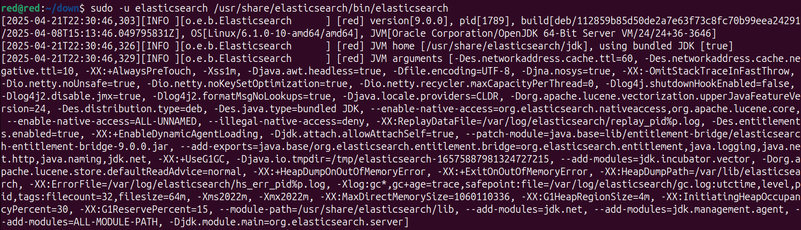

#
# Install Elasticsearch in Devuan/Debian: 

## Method -1 : By adding GPG key & adding elasticsearch repo to system

1) Elasticsearch is a Java application, so the first step is to install Java .

    Run the following as root or user with sudo privileges command to install the OpenJDK package:

    > sudo apt install default-jdk

    <p align='center' width='100%'>
        
    </p>
    <p align='center' width='100%'>
        
    </p>

    Verify the Java installation by printing the Java version :

    > java -version

    The output should look something like this:

    <p align='center' width='100%'>
        
    </p>

2) Installing Elasticsearch

    Elasticsearch is not available in the standard Debian 10 repositories. We’ll install it from the Elasticsearch APT repository.

    Import the repository’s public key using the following wget command:

    > wget -qO - https://artifacts.elastic.co/GPG-KEY-elasticsearch | sudo apt-key add -

    <p align='center' width='100%'>
        
    </p>
    this means you need something like gnupg, just install it.

    <p align='center' width='100%'>
        
    </p>
    after installing again import public repository key.

     <p align='center' width='100%'>
        
    </p>

    The command above should output OK, which means that the key has been successfully imported, and packages from this repository will be considered trusted.

    Add the Elasticsearch repository to the system by running:

   > echo "deb [signed-by=/usr/share/keyrings/elastic-keyring.gpg] https://artifacts.elastic.co/packages/8.x/apt stable main" | sudo tee /etc/apt/sources.list.d/elastic-8.x.list

    <p align='center' width='100%'>
        
    </p>

    At the time of writing this article, the latest version of Elasticsearch is 8.18.0. If you want to install a previous version of Elasticsearch, change 8.x in the command above with the version you need.

    Update the packages index and install the Elasticsearch engine:

    >sudo apt update
    >sudo apt install elasticsearch

    <p align='center' width='100%'>
        
    </p>

3) Once the installation process is complete, start, and enable the service:

    > sudo systemctl enable elasticsearch.service --now
    
    this may print error saying > systemctl: command not found

    <p align='center' width='100%'>
        
    </p>

    you may have to check whether your system uses systemd or other alternative. you can simple check it by using:
    > ps 1
    <p align='center' width='100%'>
        
    </p>

    It looks our system is using init rather than systemd, which suggests it's not based on systemd. In this case, you will need to use different commands for managing services, as systemctl will not work.

    Try using the following command to check the status of Elasticsearch with the init system:

    >sudo service elasticsearch status

    Or if you're using a SysVinit-style system, try:

    >sudo /etc/init.d/elasticsearch status

4) Start Elasticsearch (manually or via init.d)

    Since we're using Devuan (no systemd), you’ll use the SysV init script:

    >sudo /etc/init.d/elasticsearch start

    Check status:

    >sudo /etc/init.d/elasticsearch status

    if it says elasticsearch: unrecognized service, then start it up manually.
    <p align='center' width='100%'>
        
    </p>

    Try starting it directly:

    >sudo /usr/share/elasticsearch/bin/elasticsearch
    
    if it says elasticsearch didn't exit manually, then we might have to run it as elasticsearch user.

     <p align='center' width='100%'>
        
    </p>

    running it as elasticsearch user:
    >sudo -u elasticsearch /usr/share/elasticsearch/bin/elasticsearch

    or, Want to run it in the background? Use:
    > sudo -u elasticsearch nohup /usr/share/elasticsearch/bin/elasticsearch > /var/log/elasticsearch/nohup.out 2>&1 &

    or 
    > sudo -u elasticsearch nohup /usr/share/elasticsearch/bin/elasticsearch > sudo /var/log/elasticsearch/nohup.out 2>&1 &

    <p align='center' width='100%'>
        
    </p>
    this will start elastic search in background.

5) To verify that Elasticsearch is running, use curl to send an HTTP request to port 9200 on localhost:

    >curl -X GET "localhost:9200/"

    The output will look something like this:
    ````
    {
    "name" : "debian10.localdomain",
    "cluster_name" : "elasticsearch",
    "cluster_uuid" : "yCOOHdvYR8mHRs5mNXQdDQ",
    "version" : {
    "number" : "7.6.1",
    "build_flavor" : "default",
    "build_type" : "deb",
    "build_hash" : "aa751e09be0a5072e8570670309b1f12348f023b",
    "build_date" : "2020-02-29T00:15:25.529771Z",
    "build_snapshot" : false,
    "lucene_version" : "8.4.0",
    "minimum_wire_compatibility_version" : "6.8.0",
    "minimum_index_compatibility_version" : "6.0.0-beta1"
    },
    "tagline" : "You Know, for Search"
    }
    ````

    >It may take 5-10 seconds for the service to start. If you see curl: (7) Failed to connect to localhost port 9200: Connection refused, wait for a few seconds and try again.

6) Uninstallation:

    you can simply remove elastic search using:
    >sudo apt remove elasticsearch

    <p align='center' width='100%'>
        
    </p>

    & removing /etc/apt/sources.list.d/elastic-8.x.list from the user directory.


## Method - 2 : By using deb package

1) Make a directory using mkdir and navigate to it using cd command.
    > mkdir down && cd down

    <p align='center' width='100%'>
        
    </p>

2) Download the Debian Package and Checksum fusing the wget commands.

    >wget https://artifacts.elastic.co/downloads/elasticsearch/elasticsearch-9.0.0-amd64.deb
    
    >wget https://artifacts.elastic.co/downloads/elasticsearch/elasticsearch-9.0.0-amd64.deb.sha512

    <p align='center' width='100%'>
        
    </p>

3) Verify the Package Integrity using shasum.

    > shasum -a 512 -c elasticsearch-9.0.0-amd64.deb.sha512

    <p align='center' width='100%'>
        
    </p>

    This command checks the SHA-512 checksum to ensure the package hasn't been tampered with.​

4)  Install Elasticsearch

    > sudo dpkg -i elasticsearch-9.0.0-amd64.deb

    <p align='center' width='100%'>
        
    </p>

5) We can check whether the following application is installed or not in our system using dpkg or apt command :
    >dpkg -l | grep elasticsearch
    apt list --installed | grep elasticsearch

    <p align='center' width='100%'>
        
    </p>
    this shows that package elasticsearch is successfully installed in our system via deb package.

6) Since we're on Devuan (no systemd) and installed Elasticsearch via Debian package, which doesn't include a SysVinit script by default, either we have to start it manually or to create a script to control it like a service.

    Run it as the elasticsearch user:

    >sudo -u elasticsearch /usr/share/elasticsearch/bin/elasticsearch

    <p align='center' width='100%'>
        
    </p>

    ⚠️ This will keep the terminal occupied. You can leave it running or background it.

    To run it in the background:

    > sudo -u elasticsearch nohup /usr/share/elasticsearch/bin/elasticsearch > sudo /var/log/elasticsearch/nohup.out 2>&1 &

    <p align='center' width='100%'>
        
    </p>

7) (Optional)  Create the init script:

    > sudo nano /etc/init.d/elasticsearch 

    & paste the following :

    ```
    #!/bin/sh
    ### BEGIN INIT INFO
    # Provides:          elasticsearch
    # Required-Start:    $network
    # Required-Stop:     $network
    # Default-Start:     2 3 4 5
    # Default-Stop:      0 1 6
    # Short-Description: Start elasticsearch
    ### END INIT INFO

    ES_HOME="/usr/share/elasticsearch"
    ES_USER="elasticsearch"
    ES_BIN="$ES_HOME/bin/elasticsearch"
    ES_PIDFILE="/var/run/elasticsearch.pid"
    ES_LOG="/var/log/elasticsearch/elasticsearch.log"

    start() {
    echo "Starting Elasticsearch..."
    start-stop-daemon --start --quiet --background --pidfile $ES_PIDFILE --make-pidfile \
        --chuid $ES_USER --exec $ES_BIN -- -p $ES_PIDFILE >> $ES_LOG 2>&1
    }

    stop() {
    echo "Stopping Elasticsearch..."
    start-stop-daemon --stop --quiet --pidfile $ES_PIDFILE
    rm -f $ES_PIDFILE
    }

    case "$1" in
    start)
        start
        ;;
    stop)
        stop
        ;;
    restart)
        stop
        start
        ;;
    status)
        if [ -f $ES_PIDFILE ]; then
            echo "Elasticsearch is running (PID: $(cat $ES_PIDFILE))"
        else
            echo "Elasticsearch is not running"
        fi
        ;;
    *)
        echo "Usage: /etc/init.d/elasticsearch {start|stop|restart|status}"
        exit 1
    esac

    exit 0
    ```

    Make it executable:

    > sudo chmod +x /etc/init.d/elasticsearch 

    If needed, Register it to start at boot:

    > sudo update-rc.d elasticsearch defaults

    Now you can control it like a service:

    > sudo /etc/init.d/elasticsearch start
    > sudo /etc/init.d/elasticsearch status

    <p align='center' width='100%'>
        
    </p>

8) Uninstallation :

    > sudo apt remove --purge elasticsearch -y

    This removes the package and its config files.
    1. Remove leftover directories (optional)

    If you want to completely clean everything related to Elasticsearch:

    > sudo rm -rf /etc/elasticsearch
    > sudo rm -rf /var/lib/elasticsearch
    > sudo rm -rf /var/log/elasticsearch
    > sudo rm -rf /usr/share/elasticsearch
    > sudo rm -rf /var/run/elasticsearch

    2. Remove APT repo and GPG key (optional)

    If you added the Elastic APT repo earlier, remove it:

    > sudo rm /etc/apt/sources.list.d/elastic-8.x.list

    Optionally remove the GPG key:

    > sudo apt-key list | grep -A 1 "Elasticsearch"

    Find the key ID and remove it:

    >sudo apt-key del <KEY_ID>

    3. Update your package list

    > sudo apt update
    
    <p align='center' width='100%'>
        
    </p>
    
#