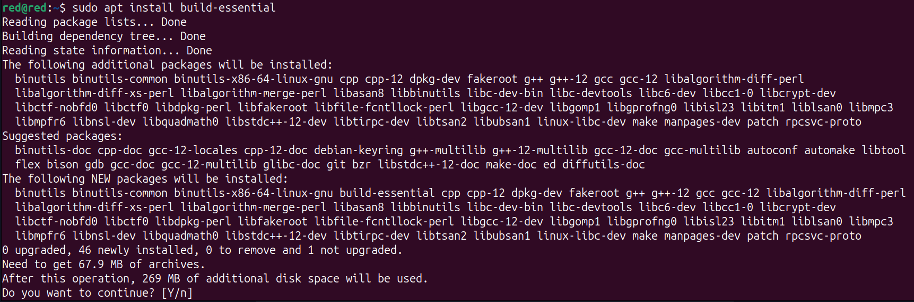
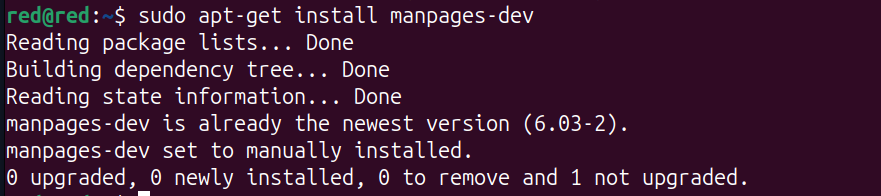
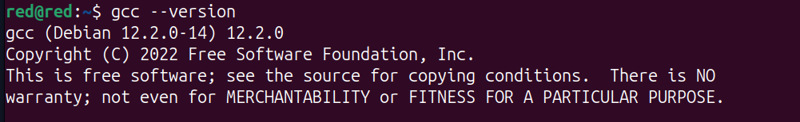

#
## Installing GCC on Debian

The default Debian repositories contain a meta-package named build-essential that contains the GCC compiler and other libraries and utilities required for compiling software.

### Follow the steps below to install the GCC Compiler Debian 12 (Bookworm):

#### 1. First, update the packages list:

    sudo apt update

#### 2. Install the build-essential package by running:

    sudo apt install build-essential

<p align='center' width='100%'>
        
</p>

You may also want to install the manual pages that includes documentation about using GNU/Linux for development:

    sudo apt-get install manpages-dev

<p align='center' width='100%'>
        
</p>

#### 3. To confirm that the GCC compiler is successfully installed type gcc --version:

    gcc --version

At the time of writing this article, the default version of GCC available in the Debian 12 repositories is 12.2.0:

    gcc (Debian 12.2.0-14) 12.2.0
    Copyright (C) 2022 Free Software Foundation, Inc.
    This is free software; see the source for copying conditions.  There is NO
    warranty; not even for MERCHANTABILITY or FITNESS FOR A PARTICULAR PURPOSE.

<p align='center' width='100%'>
        
</p>

That’s it. You have successfully installed GCC on your Debian machine.


#### 4. Compiling a Hello World Example

Compiling a basic C or C++ program with GCC is pretty straightforward. Open your text editor and create the following file:

    nano hello.c

and input any example code like: 

````
hello.c

#include <stdio.h>
int main()
{
  printf ("Hello World!\n");
  return 0;
}
````

Save the file and use the following command to compile it into an executable:

    gcc hello.c -o hello

The compiler will create a binary file named hello in the same directory, where the command was executed.

#### 5. To execute the written program, run:

    ./hello

The output will look like this:

    Hello World!

<p align='center' width='100%'>
        
</p>

#