#
# Install Mysql in debian 12

## Option - 1 : Install MariaDB (drop-in MySQL replacement) 

###  Step 1: Install MariaDB server
```bash
sudo apt update
sudo apt install mariadb-server -y
```
<p align='center' width='100%'>
        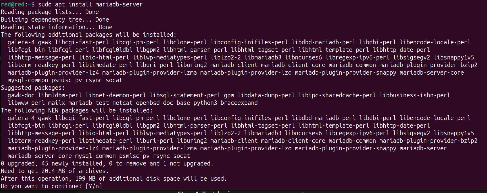
</p>

###  Step 2: Start the service
```bash
sudo service mariadb start
```
<p align='center' width='100%'>
        
</p>


###  Step 3: Secure the install
```bash
sudo mysql_secure_installation
```
<p align='center' width='100%'>
        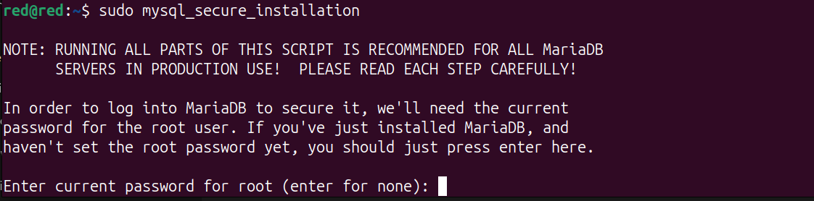
</p>

###  Step 4: Test login
```bash
sudo mysql -u root -p
```
<p align='center' width='100%'>
        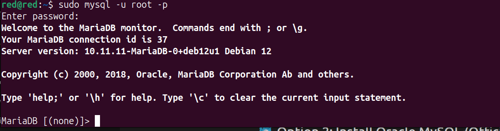
</p>


>  You can use `mysql` commands, clients, and tools exactly the same — it's MySQL-compatible.

### Step 5: Remove mariadb
remove the mariadb from the system by:

````bash
sudo apt remove mariadb-server
````

<p align='center' width='100%'>
        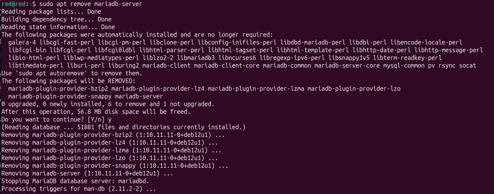
</p>
Nowclean up the residuals files 

````bash
sudo apt autoremove
````

<p align='center' width='100%'>
        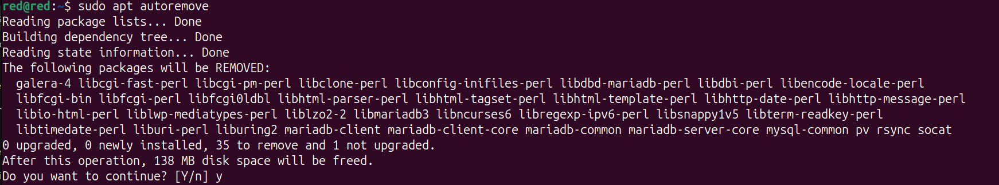
</p>


##  Option 2: Install Oracle MySQL (Official MySQL)

### 🔸 Step 1: Download MySQL APT repo config
```bash
wget https://dev.mysql.com/get/mysql-apt-config_0.8.29-1_all.deb
```
<p align='center' width='100%'>
        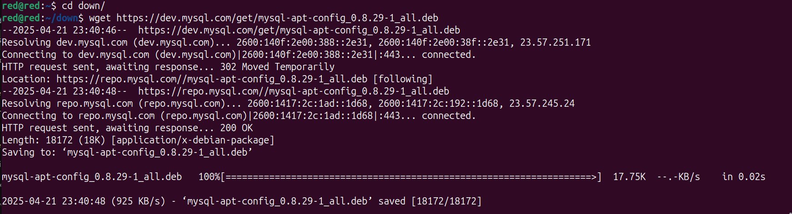
</p>


### 🔸 Step 2: Install the repo
```bash
sudo dpkg -i mysql-apt-config_0.8.29-1_all.deb
```
<p align='center' width='100%'>
        
</p>

<p align='center' width='100%'>
        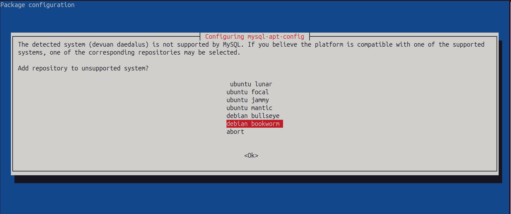
</p>
<p align='center' width='100%'>
        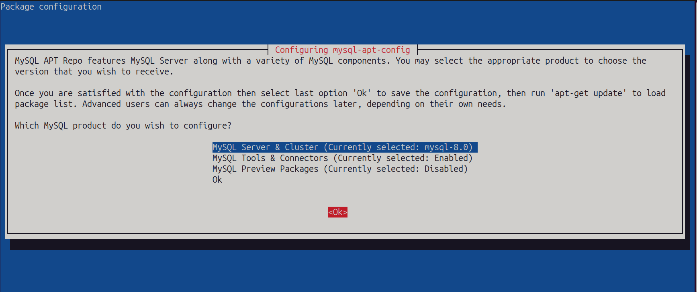
</p>
<p align='center' width='100%'>
        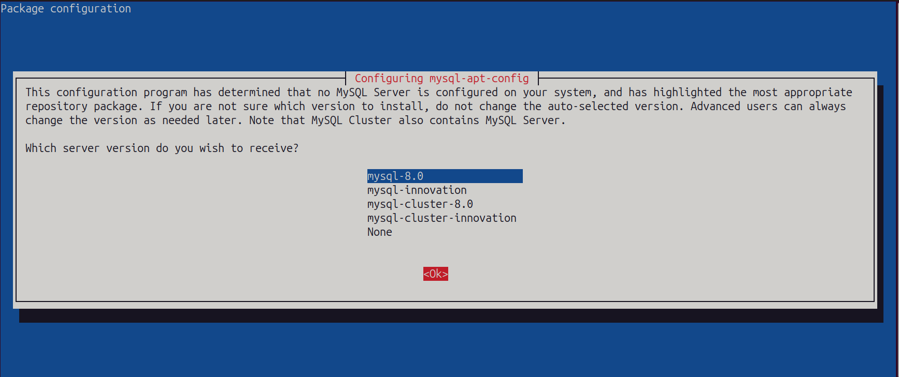
</p>


> During setup, select your version (e.g., MySQL 8.0) and hit OK.

###  Step 3: Update and install
```bash
sudo apt update
sudo apt install mysql-server -y
```
<p align='center' width='100%'>
        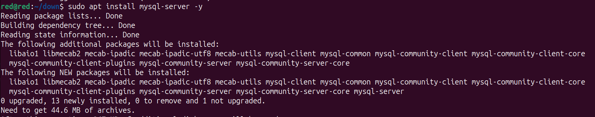
</p>


###  Step 4: Start MySQL
```bash
sudo service mysql start
```
if mysql service not found is in the output then create a script to start mysql service.

### Step 5:  Create a script to start mysql service
> sudo nano /etc/init.d/mysql

and add the following script to it:

`````bash                                                    
### BEGIN INIT INFO
# Provides:          mysql
# Required-Start:    $remote_fs $syslog
# Required-Stop:     $remote_fs $syslog
# Default-Start:     2 3 4 5
# Default-Stop:      0 1 6
# Short-Description: Start MySQL daemon
# Description:       Enable MySQL service provided by mysqld
### END INIT INFO


case "$1" in
  start)
    /usr/bin/mysqld_safe &
    ;;
  stop)
    killall mysqld
    ;;
  restart)
    $0 stop
    sleep 2
    $0 start
    ;;
  status)
    ps aux | grep mysql
    ;;
  *)
    echo "Usage: $0 {start|stop|restart|status}"
    exit 1
esac
exit 0
`````

###  Step 6: Start MySQL & Check its status
```bash
sudo service mysql start
sudo service mysql status
```

<p align='center' width='100%'>
        
</p>

<p align='center' width='100%'>
        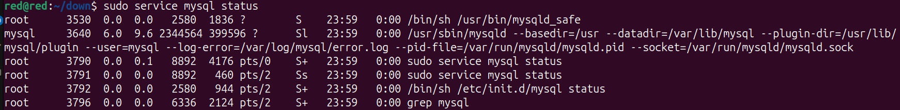
</p>

### Step 7: Test login

````bash 
sudo mysql -u root -p
````

<p align='center' width='100%'>
        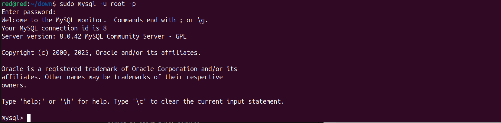
</p>

You can use mysql commands, clients, and tools exactly the same — it's MySQL-compatible.

#