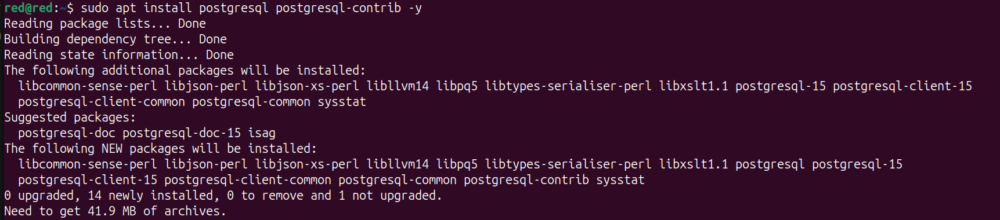
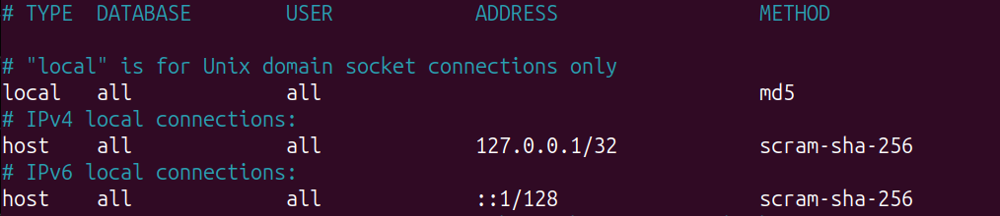
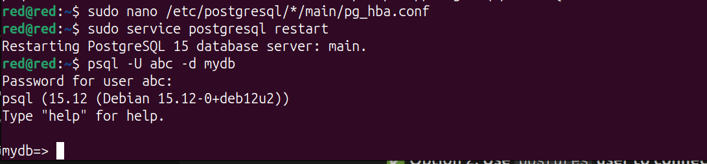

#
# Install PostgreSQL on Devuan

###  1. Update your package list
```bash
sudo apt update
```

###  2. Install PostgreSQL
```bash
sudo apt install postgresql postgresql-contrib -y
```

- `postgresql`: the core database server
- `postgresql-contrib`: additional useful tools and extensions (like `uuid-ossp`, `pg_stat_statements`, etc.)

<p align='center' width='100%'>
        
</p>

###  3. Check PostgreSQL status


```bash
sudo service postgresql status
```

Or start it manually:
```bash
sudo service postgresql start
```

<p align='center' width='100%'>
        
</p>

###  4. Switch to the `postgres` user
```bash
sudo -i -u postgres
```

Then open the PostgreSQL prompt:
```bash
psql
```

You should see:
```
postgres=#
```

###  5. Create a database and user

From the `postgres=#` prompt:
```sql
CREATE DATABASE mydb;
CREATE USER myuser WITH ENCRYPTED PASSWORD 'mypassword';
GRANT ALL PRIVILEGES ON DATABASE mydb TO myuser;
```

Exit `psql`:
```sql
\q
```

Exit the `postgres` user:
```bash
exit
```

<p align='center' width='100%'>
        
</p>

###  6. Enable PostgreSQL to start at boot
```bash
sudo update-rc.d postgresql defaults
```


###  7. Allow remote connections (optional)

To allow remote access (e.g., from another machine):

Edit config:
```bash
sudo nano /etc/postgresql/*/main/postgresql.conf
```

Find:
```conf
#listen_addresses = 'localhost'
```
Change to:
```conf
listen_addresses = '*'
```

Then edit:
```bash
sudo nano /etc/postgresql/*/main/pg_hba.conf
```

Add:
```conf
host    all             all             0.0.0.0/0            md5
```

Restart PostgreSQL:
```bash
sudo service postgresql restart
```

### 8. Login to psql database

````bash
psql -U username -d tablename
````
Example:
````bash
psql -U abc -d mydb
````

<p align='center' width='100%'>
        
</p>

That error means PostgreSQL is trying to use **peer authentication**, which matches your **Linux username** to the **PostgreSQL username** — and they're not matching.

### 9. Use password-based authentication (md5)

1. Edit `pg_hba.conf` file:
```bash
sudo nano /etc/postgresql/*/main/pg_hba.conf
```

2. Find the line like this:
```
local   all             all                                     peer
```

3. Change `peer` to `md5`:
```
local   all             all                                     md5
```
<p align='center' width='100%'>
        
</p>

4. Save and exit (`Ctrl+O`, `Enter`, `Ctrl+X`)

5. Restart PostgreSQL:
```bash
sudo service postgresql restart
```

6. Now try:
```bash
psql -U abc -d mydb
```

It should now **ask for a password**, and you can log in with the one you set earlier.

<p align='center' width='100%'>
        
</p>

You are successfully connected to postgresdb.

#