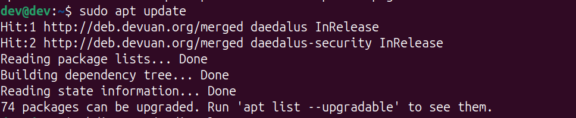
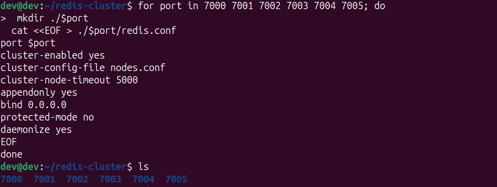
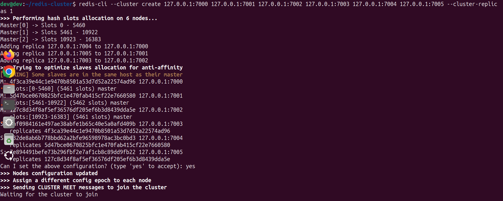
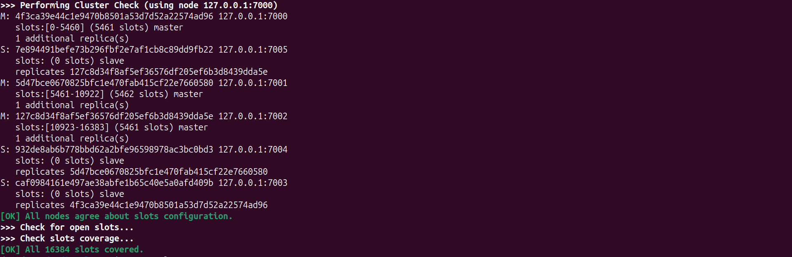
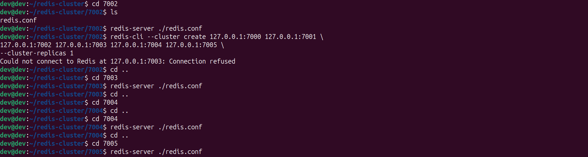
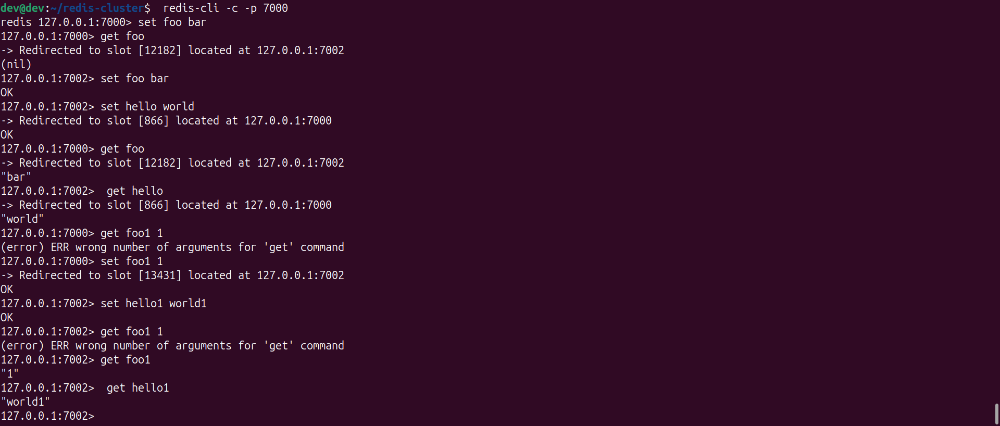

#
# Redis Cluster Setup

This guide walks you through setting up a 6-node Redis Cluster (3 masters, 3 replicas) on your local machine using custom configuration files.

##  Prerequisites

- Redis installed on your system.
- A Debian-based OS (e.g., Devuan, Ubuntu).
- Basic command-line knowledge.

##  Step-by-Step Setup

### 1. Update System Packages
```bash
sudo apt update
```

<p align='center' width='100%'>
        
</p>

### 2. Create Directory Structure for Cluster
```bash
mkdir -p ~/redis-cluster
cd ~/redis-cluster
```
<p align='center' width='100%'>
        
</p>

### 3. Generate Config Files for Each Node
```bash
for port in 7000 7001 7002 7003 7004 7005; do
  mkdir ./$port
  cat <<EOF > ./$port/redis.conf
port $port
cluster-enabled yes
cluster-config-file nodes.conf
cluster-node-timeout 5000
appendonly yes
bind 0.0.0.0
protected-mode no
daemonize yes
EOF
done
```

<p align='center' width='100%'>
        
</p>

### 4. Start Redis Servers
```bash
for port in 7000 7001 7002 7003 7004 7005; do
  redis-server ~/redis-cluster/$port/redis.conf
done
```

> If a port is not available, start those instances manually:
```bash
redis-server ~/redis-cluster/7001/redis.conf
```

<p align='center' width='100%'>
        
</p>

### 5. Create the Cluster
```bash
redis-cli --cluster create \
127.0.0.1:7000 127.0.0.1:7001 127.0.0.1:7002 \
127.0.0.1:7003 127.0.0.1:7004 127.0.0.1:7005 \
--cluster-replicas 1
```
You’ll be prompted:
```
Can I set the above configuration? (type 'yes' to accept):
```
Type `yes`.

<p align='center' width='100%'>
        
</p>
<p align='center' width='100%'>
        
</p>

> or you may face problem on connection refusal on other ports.

<p align='center' width='100%'>
        
</p>

### 6. Start ports manually

```bash
cd redis-cluster/7002
redis-server ./redis.conf
```
and so on for each node giving connection problem

<p align='center' width='100%'>
        
</p>

### 7. Verify Cluster Status
```bash
redis-cli --cluster check 127.0.0.1:7000
```

Expected output:
- All nodes agree about slots configuration.
- All 16384 slots covered.


### 8. Interact with the Cluster
Use `-c` flag for cluster mode:
```bash
redis-cli -c -p 7000
```
<p align='center' width='100%'>
        
</p>


Example commands:
```bash
set foo bar
get foo
set hello world
get hello
```

You may be redirected to the appropriate node depending on the key's hash slot.


##  Example Output

```bash
127.0.0.1:7000> set foo bar
-> Redirected to slot [12182] located at 127.0.0.1:7002
OK

127.0.0.1:7000> get foo
-> Redirected to slot [12182] located at 127.0.0.1:7002
"bar"
```


##  Notes

- Make sure all Redis instances are running before creating the cluster.
- Use `redis-cli -p <port> ping` to check individual node health.
#