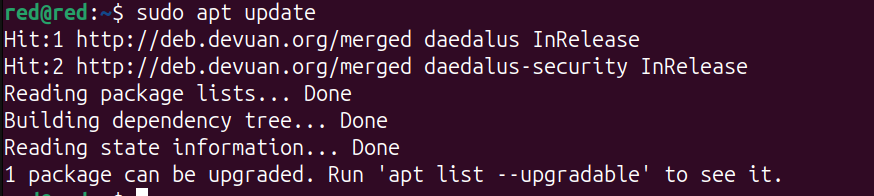
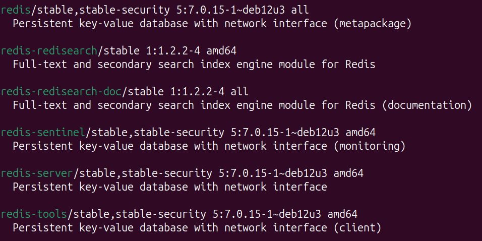
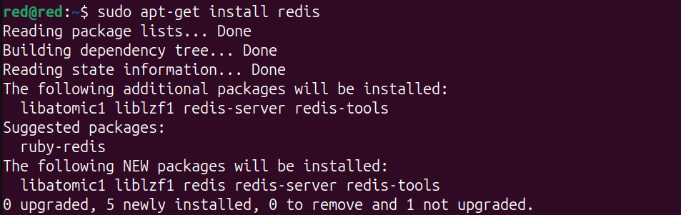
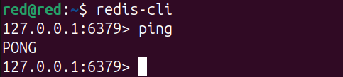
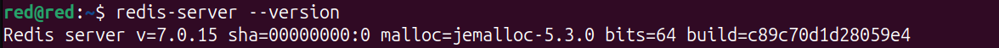

#
# Install Redis on Debian 

1) Login to your Debian System

    First, you’ll need to access your terminal.
    check for available package updates.
    

        
    

    here, we got user devuan is not in sudoers file as a response from the terminal.

2) Then check whether your system has redis installed or not simply by typing redis-cli. 
    If not found then simply we need to install it in our system. 

3) Now, check whether redis is available in the apt packages or not via :

            sudo apt search redis

     

        
    

     

        
    

    Here, we got response as redis is available in our apt package.

4) if redis found in apt packages then install it by executing this command:

        sudo apt-get install redis
    
     

        
    

    this command will install redis on your system.

5) you can test redis by executing: redis-cli on your terminal which will give you the following output :

    

        
    

    or, you can simply check redis-server version.

     

        
    

    if redis not found then you have to install redis from its repository: [redis-repo-link](https://redis.io/docs/latest/operate/oss_and_stack/install/archive/install-redis/install-redis-on-linux/)

