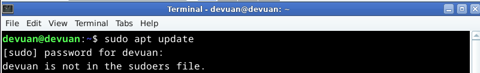
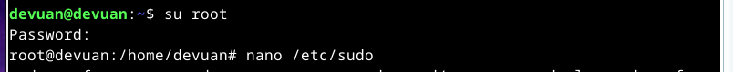
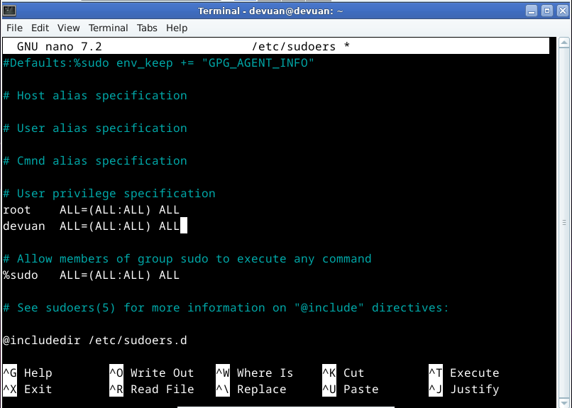
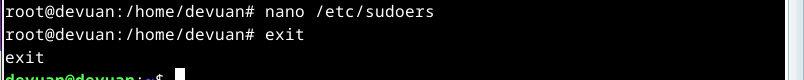
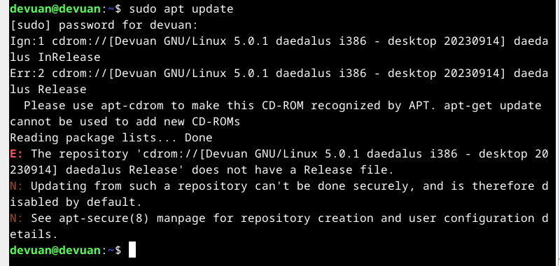
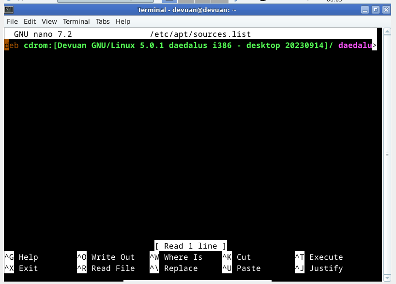
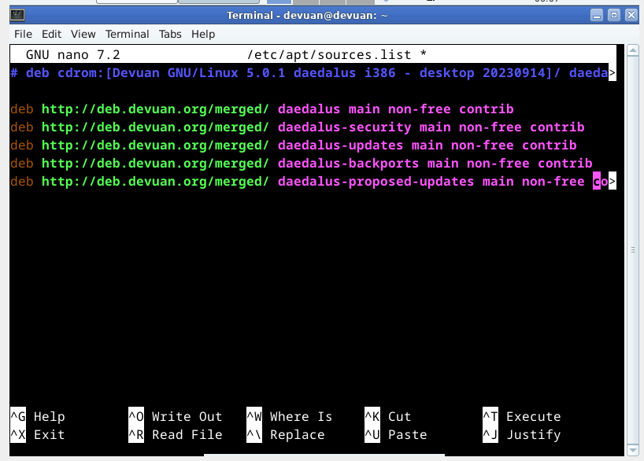
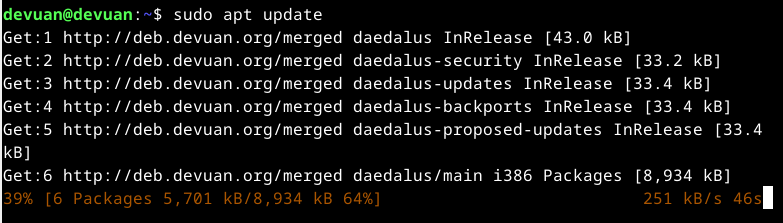

#
# How to Add User to Sudoers in Debian

1) Login to your Debian System

    First, you’ll need to access your terminal. then lets assume we have to check for updates:

        
    

here, we got user devuan is not in sudoers file as a response from the terminal.

2) Now, we have to simply login as a root user:

        su - root
        
and goes to the directory /etc/sudo

        
    

3)  then, search for the line containing user privelege & add the given line below it.

        user ALL=(ALL:ALL) ALL
     #### replace user to the actual username like in my case it is devuan

        
    

add the line and exit to save the file.

4)  Exit from the root user.

        
    

5) Checking for whether the user is added to the sudoer list.

    simply use any command which needs the usage of sudo privileges.

        

    here, for sudo apt update we didn't get any reply from terminal saying user is not in sudoers file but we get some error related to cdrom or something other such as :

        Media change: please insert the disc labeled
            'Devuan GNU/Linux 5.0.1 daedalus amd64 - desktop 20230914'
        in the drive '/media/cdrom/' and press [Enter]

    let's discuss how to solve this type of problem.
#
# How to solve system asking for insertion of cd rom 

1) first, let discuss about our problem.

         Media change: please insert the disc labeled
            'Devuan GNU/Linux 5.0.1 daedalus amd64 - desktop 20230914'
         in the drive '/media/cdrom/' and press [Enter]

    #### we obviously did an offline install & we will have to setup your sources.list correctly. In this case the sources.list just contains a reference to the cdrom of the installation medium. 

2) simply access to or goes to the location /etc/apt/sources.list 

        
    

        
    

3) here, we got the line containing cdrom. comment(#) the line containing cdrom & add these lines below: 

        deb http://deb.devuan.org/merged/ daedalus main non-free contrib 
        deb http://deb.devuan.org/merged/ daedalus-security main non-free contrib 
        deb http://deb.devuan.org/merged/ daedalus-updates main non-free contrib 
        deb http://deb.devuan.org/merged/ daedalus-backports main non-free contrib 
        deb http://deb.devuan.org/merged/ daedalus-proposed-updates main non-free contrib 

        

    save the file and exit.

4) Now, we have successfully solved the problem regarding cdrom.

        
    

#